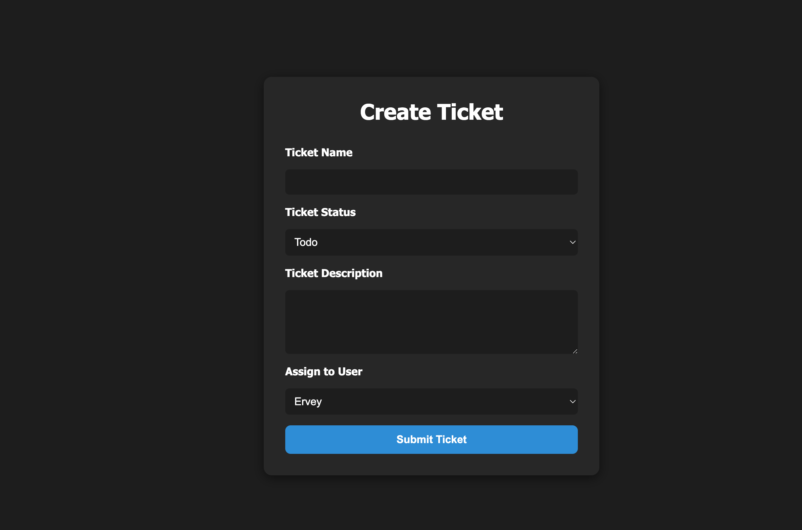

# Krazy Kanban Board 🧠

Krazy Kanban Board is a full-stack application built with **React**, **TypeScript**, **Node.js**, **Express**, and **PostgreSQL**. It allows users to securely log in, create and manage work tickets, and organize them visually using **drag & drop** across a Kanban board.

---

## ✨ Features

- ✅ **Secure Login** with JWT authentication
- 🔐 Login page with validation and redirection
- 🧾 Create tickets with title, description, status, and user assignment
- 🧩 Drag & drop tickets between columns ("Todo", "In Progress", "Done")
- 📊 Fully connected to a PostgreSQL database
- 🎨 Custom styles and column color differentiation
- 💻 Clean, responsive UI

---

## 🔐 Login Screen

Users log in with a username and password to access the board.


---

## 📝 Create Ticket

Users can create a new ticket by filling in:
- Ticket name
- Status (Todo, In Progress, Done)
- Description
- Assigned user



---

## 📋 Kanban Board

The main board contains three swimlanes. Each lane holds tickets by status. Users can:
- Edit or delete tickets
- Move tickets by dragging them to another column


---

## 🛠 Technologies

- **Frontend**: React + TypeScript + Vite + React Router
- **State Management**: React Hooks
- **Drag and Drop**: `react-beautiful-dnd`
- **Backend**: Node.js + Express + Sequelize
- **Database**: PostgreSQL
- **Auth**: JSON Web Tokens (JWT)

---

## 🚀 Local Setup

1. Clone the repository
2. Install dependencies:

   ```bash
   cd server
   npm install

   cd ../client
   npm install
   ```

3. Create a `.env` file in the `server/` folder:

   ```
   DB_NAME=your_database_name
   DB_USER=your_db_user
   DB_PASSWORD=your_db_password
   JWT_SECRET=your_jwt_secret
   ```

4. Run both servers:

   ```bash
   cd server
   npm run dev

   cd ../client
   npm run dev
   ```

---

## 🌐 Deployment

The app is fully deployable using [Render](https://render.com) for both client and server.

---

## ✍️ Author

Developed by **Ervey Garcia** as part of a Full-Stack Web Development Bootcamp challenge.

---
